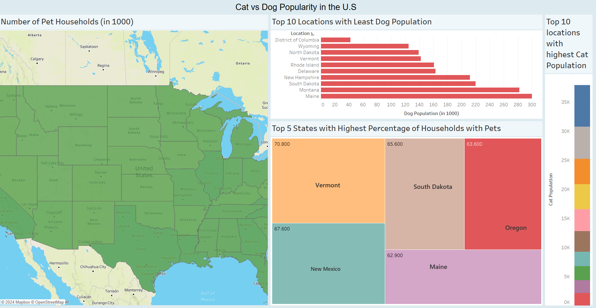

# U.S. Pet Households: A State-by-State Breakdown Dashboard

This repository contains a Tableau Dashboard that provides a comprehensive visualization of pet ownership across the United States, broken down by state. The dashboard offers insights into the distribution and percentage of households with pets, allowing users to explore pet ownership trends across different regions.

## Overview
The U.S. Pet Households: A State-by-State Breakdown dashboard is designed to give users an intuitive and interactive way to explore the following:

* State-by-state pet ownership: View the proportion of households with pets for each U.S. state.
* Comparative Analysis: Compare pet ownership rates across states or regions.
* Visual Trends: Explore visual trends and patterns in pet ownership, enabling insights into regional differences.
## Key Features
* Interactive Map: A color-coded map showing pet ownership data per state.
* Dynamic Filters: Allows users to filter data by different parameters (e.g., pet type, total number of households, etc., if applicable).
* Hover Tooltips: Display detailed statistics when hovering over specific states.
* Visual Insights: Use charts and graphs to better understand pet ownership distribution across the U.S.
